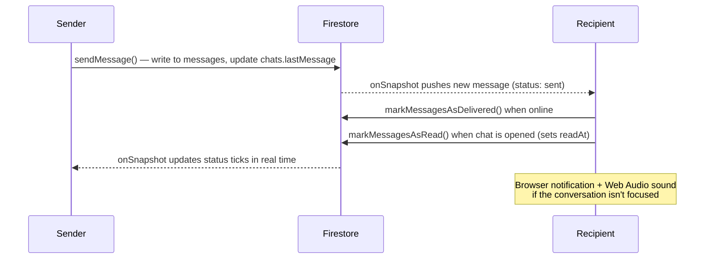

# Social Chat App

**A real-time 1-to-1 messaging platform with read receipts, push notifications, a blue-tick verification workflow, and a full live-updating admin console — built on Next.js 15, React 19, and Firebase.**


Everything updates in real time — chats, message status, admin dashboards, and verification queues are all driven by live Firestore listeners, with no polling and no page refreshes.

## Features

### Messaging
- **Real-time 1-to-1 chat** powered by Firestore `onSnapshot` listeners — messages appear instantly on both sides.
- **Full message status lifecycle**: `sent → delivered → read`, with `readAt` timestamps and batched status updates.
- **Unread counters** per conversation, computed live for the chat list.
- **Deterministic chat IDs** (sorted user-ID pair), so a conversation between two users is always created exactly once.
- **Debounced user search** by name, email, or phone with relevance-ranked results to start new conversations.

### Notifications
- **Firebase Cloud Messaging integration**: VAPID-based FCM token retrieval, a foreground `onMessage` listener, and a dedicated service worker ([`public/sw.js`](./public/sw.js)) that renders background notifications with click-to-open actions.
- **Browser notifications** for incoming messages (sender name + avatar) when the conversation isn't focused.
- **Notification sound** synthesized on the fly with the Web Audio API — no audio asset needed.
- **Per-user preferences** persisted to Firestore: notifications on/off, message alerts, and sound, with a settings UI.
- **Capability detection**: secure-context and browser-API checks degrade gracefully when push isn't supported.

### Accounts & profiles
- **Email/password and Google OAuth** sign-in via Firebase Auth, with automatic Firestore profile provisioning on first login and `lastLogin` tracking.
- **Rich profiles**: avatar, phone, date of birth, gender — editable through an allow-listed update path so clients can't write protected fields like `role`.
- **Auth-aware routing**: the landing page redirects signed-in users straight to `/chat` and guests to `/auth/login`.

### Blue-tick verification
- **User-initiated requests** with a stated reason, tracked through a `PENDING → VERIFIED / REJECTED` workflow.
- **Admin review queues** (pending and processed) streamed in real time, with the processing admin, timestamp, and decision note recorded on each request.
- **Verified badge** rendered next to user names across the app.

### Admin console (`/admin`)
- **Role-gated**: the admin layout verifies `role === 'ADMIN'` from Firestore and redirects everyone else.
- **Live dashboard**: user stats, recent signups, chat/message stats, top active users, and system metrics — all real-time subscriptions.
- **User management**: searchable user table, create/update/delete, bulk actions, and ban/unban.
- **Moderation**: message reporting, review of reported messages, and message deletion.
- **Audit log**: every admin action is recorded to an `adminActions` collection.
- **CSV export** of user and chat data, generated client-side from Firestore.

## Tech stack

| Layer | Technology |
|---|---|
| Framework | [Next.js](https://nextjs.org/) 15.5 (App Router, Turbopack) |
| UI | [React](https://react.dev/) 19.1, [Tailwind CSS](https://tailwindcss.com/) 4 |
| Language | [TypeScript](https://www.typescriptlang.org/) 5 (strict) |
| Backend-as-a-service | [Firebase](https://firebase.google.com/) 12 — Authentication, Cloud Firestore, Cloud Messaging |
| Auth bindings | [react-firebase-hooks](https://github.com/CSFrequency/react-firebase-hooks) 5.1 |
| Linting | ESLint 9 (flat config) + `eslint-config-next` |

## Architecture

The app follows a **thin pages → feature modules → service layer** pattern:

```
Route (src/app/…/page.tsx)  →  Feature (src/features/…)  →  Services (src/lib/…)  →  Firebase
```

- **Pages are one-liners** — every App Router page just renders a feature component (e.g. `/chat` renders `ChatFeature`), keeping routing and logic fully decoupled.
- **Feature modules** (`auth`, `chat`, `home`, `admin`) own their UI state and compose shared components.
- **Service layer** (`src/lib`) encapsulates all Firebase access: `chat.ts` (messaging + status), `auth.ts` (sign-in flows + user search), `notificationService.ts` (FCM + service-worker lifecycle, singleton), `adminService.ts` (moderation + audit log), `blueTickService.ts` (verification workflow), `userService.ts` and `dashboardService.ts` (admin data + CSV export). Real-time services hand back unsubscribe functions and keep listener registries with `cleanupAll*Listeners()` helpers to prevent leaks.

### Message flow



### Data model

Firestore collections: `users`, `chats`, `messages`, `adminActions`, `reportedMessages`. The composite indexes required by the chat-list and status queries are version-controlled in [`firestore.indexes.json`](./firestore.indexes.json) and deployable via the Firebase CLI.

## Project structure

```
├── src/
│   ├── app/                # Next.js App Router — thin route wrappers
│   │   ├── auth/           #   /auth/login, /auth/register
│   │   ├── chat/           #   /chat — the messenger UI
│   │   └── admin/          #   /admin, /admin/users — role-gated console
│   ├── features/           # Feature modules (auth, chat, home, admin)
│   ├── components/         # Shared UI (ChatInterface, MessageStatus, BlueTickBadge, …)
│   ├── hooks/              # useNotifications — preferences, FCM listener, sound
│   ├── lib/                # Firebase service layer (chat, auth, admin, notifications, …)
│   └── types/              # Shared TypeScript models (User, Message, Chat, BlueTick)
├── public/sw.js            # FCM service worker for background notifications
├── firebase.json           # Firebase project config (Firestore rules + indexes)
├── firestore.indexes.json  # Composite indexes for chat & status queries
├── firestore.rules         # Firestore security rules
└── docs/                   # In-depth feature documentation
```

## Getting started

### Prerequisites

- **Node.js 18.18+** (Node 20 LTS recommended)
- A **Firebase project** with **Authentication** (Email/Password + Google providers) and **Cloud Firestore** enabled

### Setup

1. **Clone and install**

   ```bash
   git clone https://github.com/DucMinhNe/SocialProject.git
   cd SocialProject
   npm install
   ```

2. **Configure Firebase**

   Copy the example env file and fill in your own project's web config (*Firebase Console → Project Settings → General → Your apps*):

   ```bash
   cp .env.local.example .env.local
   ```

   > Note: [`public/sw.js`](./public/sw.js) initializes Firebase independently and can't read environment variables — replace its `firebaseConfig` object with the same values.

3. **Set the Web Push key**

   Generate a VAPID key pair in *Firebase Console → Project Settings → Cloud Messaging* and put it in `.env.local`:

   ```env
   NEXT_PUBLIC_VAPID_KEY=your-vapid-public-key
   ```

4. **Deploy Firestore rules & indexes** (optional, requires the Firebase CLI)

   ```bash
   firebase deploy --only firestore
   ```

   > Note: the committed [`firestore.rules`](./firestore.rules) are wide-open development rules — lock them down before any production use.

5. **Run the dev server** (Turbopack)

   ```bash
   npm run dev
   ```

   Open [http://localhost:3000](http://localhost:3000) — you'll be redirected to the login page, and to `/chat` once signed in.

### Admin access

Set `role: "ADMIN"` on a user's document in the Firestore `users` collection to unlock the admin console at `/admin`.

### Production build

```bash
npm run build
npm start
```

The app is a standard Next.js project and deploys to any Next.js-compatible host (e.g. Vercel).

## Documentation

Detailed write-ups live in the [`docs/`](./docs/) folder (written in Vietnamese for the project team):

- [Chat features](./docs/README-CHAT.md) and the [message status system](./docs/MESSAGE-STATUS.md)
- [Notification usage](./docs/NOTIFICATION-USAGE.md) and [notification logic](./docs/NOTIFICATION-LOGIC.md)
- [Performance optimizations](./docs/PERFORMANCE-OPTIMIZATION.md)
- [Feature module structure](./docs/FEATURES-STRUCTURE.md) and the [service layer](./docs/README-SERVICES.md)
- [User schema](./docs/USER-FIELDS-UPDATE.md)

## Contributing

1. Fork the repository and create a feature branch.
2. Make your changes (`npm run lint` should pass).
3. Update the relevant docs in `docs/` if behavior changes.
4. Open a pull request.
